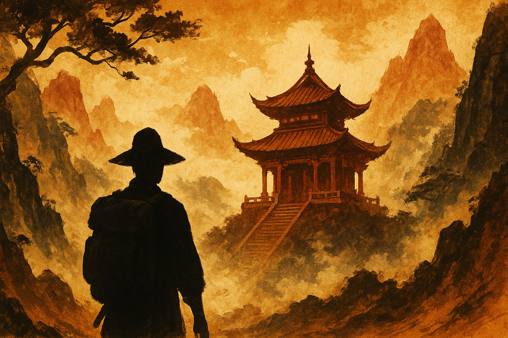

# The Temple of Neural Networks: A PyTorch Martial Arts Journey 🏯

## **The Sacred Temple**

High in the misty mountains stands the **Temple of Neural Networks**, an ancient monastery where monks have mastered the mystical arts of machine learning. For centuries, they have studied the flow of gradients, the dance of backpropagation, and the deep mysteries of optimization.

You arrive as a humble **Grasshopper** 🦗, eager but untrained, ready to begin the sacred journey from novice to master.

<picture>
  
</picture>

---

## **The Characters of Your Journey**

### **🌱 You: The Grasshopper**
*"Enthusiasm without wisdom is like training without data - much noise, little progress."*

A young, eager disciple who arrives at the temple with grand dreams but must start with humble tasks. Makes rookie mistakes, asks obvious questions, but grows stronger with each trial.

### **🧙 Master Pai-Torch**
*"The path of the neural warrior is paved with tensors, young one."*

The ancient grandmaster of the temple. Speaks in cryptic koans about gradients and loss functions. Has a habit of appearing mysteriously when you're stuck on a particularly tricky debugging problem. Claims to have invented the first neural network using only bamboo and meditation.

### **⚡ Master Ao-Tougrad**
*"I am the shadow behind every gradient, the whisper in every backward pass."*

The mysterious keeper of the backpropagation arts. Rarely speaks directly but leaves helpful hints when your gradients vanish or explode. Has an unsettling habit of finishing your code comments before you write them.

### **🍜 Cook Oh-Pai-Timizer**
*"Good soup needs the right ingredients in the right proportions - just like good learning rates!"*

The temple's head cook who somehow relates every cooking technique to optimization algorithms. Accidentally teaches you about momentum while stirring soup, and explains Adam optimizer while making bread.

### **🧹 He-Ao-World, the Temple Janitor**
*"Oh! So sorry about that mess! These old hands aren't as steady as they used to be..."*

The temple's humble janitor who's been cleaning these halls for decades. Always seems to be around when things go wrong with the data - spilling water on records, knocking over counting tools, or forgetting to log measurements. Apologizes profusely for his "clumsiness" but there's something oddly convenient about his timing.

### **🐱 Suki the Temple Cat**
*"Meow." (Translation: "Your model is overfitting, human.")*

The temple's sacred feline oracle. Her behaviors serve as training data for many beginner exercises. Rumored to understand tensor operations better than most humans, but refuses to share her knowledge except through cryptic purrs.

---

## **The Five Dan Progression**

### **Dan 1: Temple Sweeper** 🧹
*"Before learn how to clean data, you must first clean floors."*

**Sacred Duties**: Basic temple maintenance and caring for animals
**Hidden Lessons**: Tensor operations, linear relationships, basic training loops
**Trials**: Predict temple cat's feeding times, calculate rice portions, monitor candle burning

**Master's Wisdom**: *"The broom teaches you about iteration, the cat about patterns, the rice about scaling. All neural arts begin with these fundamentals."*

### **Dan 2: Temple Guardian** 🛡️
*"A guardian protects against many threats - thieves, demons, and overfitting."*

**Sacred Duties**: Protecting temple artifacts and maintaining defenses
**Hidden Lessons**: Regularization, validation, multiple layers, optimization
**Trials**: Create protective wards (dropout), balance multiple threats, schedule patrol routes

**Master's Wisdom**: *"The wise guardian knows that the strongest defense adapts to each threat. So too must your networks adapt to each dataset."*

### **Dan 3: Weapon Master** ⚔️
*"Different demons require different weapons. Master them all."*

**Sacred Duties**: Forging specialized weapons for unique threats
**Hidden Lessons**: CNNs, RNNs, attention mechanisms, transfer learning
**Trials**: Craft the Convolutional Blade, master the Recurrent Staff, forge Attention Armor

**Master's Wisdom**: *"The master of one weapon is strong, but the master of many weapons is unstoppable. Each architecture serves its purpose."*

### **Dan 4: Combat Innovator** 🌟
*"True strength comes from creating new techniques, not just copying old ones."*

**Sacred Duties**: Developing new fighting styles for unprecedented challenges
**Hidden Lessons**: Custom loss functions, multi-task learning, adversarial training
**Trials**: Design combo techniques, fight shapeshifting opponents, teach others

**Master's Wisdom**: *"When the ancient scrolls offer no guidance, the true master writes new scrolls. Innovation is the highest form of understanding."*

### **Dan 5: Mystic Arts Master** 🔮
*"At the pinnacle, you transcend mere prediction and begin to create reality itself."*

**Sacred Duties**: Communing with the data spirits and creating new worlds
**Hidden Lessons**: GANs, diffusion models, graph networks, meta-learning
**Trials**: Dream new data into existence, peer into alternate realities, teach the temple itself

**Master's Wisdom**: *"The ultimate master realizes that data and dreams are one. You are no longer learning from the world - you are creating new worlds."*

---

## Kata index

All katas in this repository:

### Dan 1: Temple Sweeper 🧹

- **[The Mysteries of Suki's Appetite: A Linear Revelation](dan_1/kata_01_temple_cat_feeding_predictor_unrevised.ipynb)** - Master the fundamentals of PyTorch through linear regression, predicting when the temple cat will appear at her feeding bowl. Learn tensor operations, gradient descent, and the sacred training loop while decoding Suki's feeding patterns. *Concepts: Linear layers, MSE loss, SGD optimizer, gradient management*

---

## **About This Repository**

This repository contains a series of **Code Katas** focused on PyTorch and neural networks. Code Katas are programming exercises designed to help developers practice and refine their skills through repetitive, focused practice—much like martial arts katas help practitioners perfect their techniques through repeated forms.

Originally popularized by Dave Thomas, Code Katas are small, self-contained programming challenges that emphasize learning through deliberate practice. The term "kata" comes from martial arts, where practitioners perform choreographed sequences of movements to build muscle memory and perfect their technique.

### **Learning Philosophy**

**This repository focuses on practice, not teaching.** The exercises here assume you already have some familiarity with the concepts being practiced. You'll need additional resources to properly learn the theoretical foundations of neural networks, PyTorch, and deep learning. We'll include links to helpful resources where possible, but the primary goal is hands-on reinforcement of concepts you're already studying.

Think of these exercises as a gym for your PyTorch skills—you come here to build strength and muscle memory, not to learn the theory behind why lifting weights makes you stronger.

### **Why PyTorch for Everything?**

**All problems in this repository are deliberately solved using neural networks and PyTorch, even when they're not the best tool for the job.** This is by design. In the real world, you'd solve many of these problems using simpler approaches:

- **Linear regression** problems would typically use scikit-learn's LinearRegression or statistical packages like statsmodels
- **Classification** tasks might be better handled with traditional machine learning algorithms
- **Time series** problems could use specialized forecasting libraries
- **Optimization** problems might benefit from scipy.optimize or specialized solvers

But here's the point: **we're not trying to solve problems optimally—we're trying to practice PyTorch optimally.** Just like a pianist practices scales even though they'll never perform a scale in concert, you'll implement neural networks for simple problems to build fluency with tensors, gradients, and training loops.

This approach helps you:
- Build intuition for how neural networks behave on simple, interpretable problems
- Practice PyTorch syntax and patterns in low-stakes environments
- Understand the mechanics of backpropagation and optimization
- Develop debugging skills when things go wrong
- Build confidence before tackling more complex, real-world applications

### **Getting Started**

1. **Choose your skill level** - Start with Dan 1 if you're new to PyTorch, or jump to a higher Dan if you have experience
2. **Work through exercises sequentially** - Each kata builds on concepts from previous ones
3. **Don't rush** - Take time to understand what's happening in each step
4. **Experiment** - Try modifying parameters, architectures, and data to see what happens
5. **Debug actively** - When things go wrong, use it as a learning opportunity

### **Prerequisites**

- Basic Python programming skills
- Some familiarity with machine learning concepts (supervised learning, training/validation, overfitting)
- Basic mathematical concepts (linear algebra, calculus helpful but not required)
- Willingness to look up concepts you don't understand

### **Recommended Learning Resources**

- **PyTorch Official Tutorial**: https://pytorch.org/tutorials/
- **Deep Learning Book** by Ian Goodfellow, Yoshua Bengio, and Aaron Courville: https://www.deeplearningbook.org/
- **Practical Deep Learning for Coders** by fast.ai: https://course.fast.ai/
- **Neural Networks and Deep Learning** by Michael Nielsen (free online book): http://neuralnetworksanddeeplearning.com/

### **About Kata Creation**

The katas in this repository are generated by **Claude Code** and later revised by humans for accuracy and clarity. The `CLAUDE.md` file contains detailed instructions that guide Claude Code in creating new exercises following the established format and learning progression.

You can try creating new katas yourself using the Claude Code command:
```bash
/create-kata [dan_level] [optional_topic]
```

**Examples:**
- `/create-kata 1` - Create a basic Dan 1 kata
- `/create-kata 1 a basic linear regression kata about Suki's feeding patterns, presented by Pai-Torch` - Create a specific Dan 1 kata with detailed story requirements
- `/create-kata 2 regularization` - Create a Dan 2 kata focused on regularization
- `/create-kata 3 cnn` - Create a Dan 3 kata about convolutional neural networks

**Command Parameters:**
- **Dan Level**: Required (1-5) - determines the complexity and concepts
- **Optional Topic**: Specific concept to focus on (e.g., "optimization", "dropout", "attention")

**Important Notes**: 
- Katas that haven't been reviewed by a human yet have the suffix `_unrevised.ipynb`. These may contain errors, inconsistencies, or unclear instructions, so please be mindful when working through them. We recommend starting with the fully reviewed katas first.
- Each new kata automatically checks existing katas to avoid duplication and adds itself to this README
- All katas follow the temple narrative with consistent character personalities and progressive difficulty

Remember: come here to practice what you're learning elsewhere, not to learn it for the first time!

